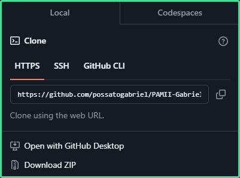
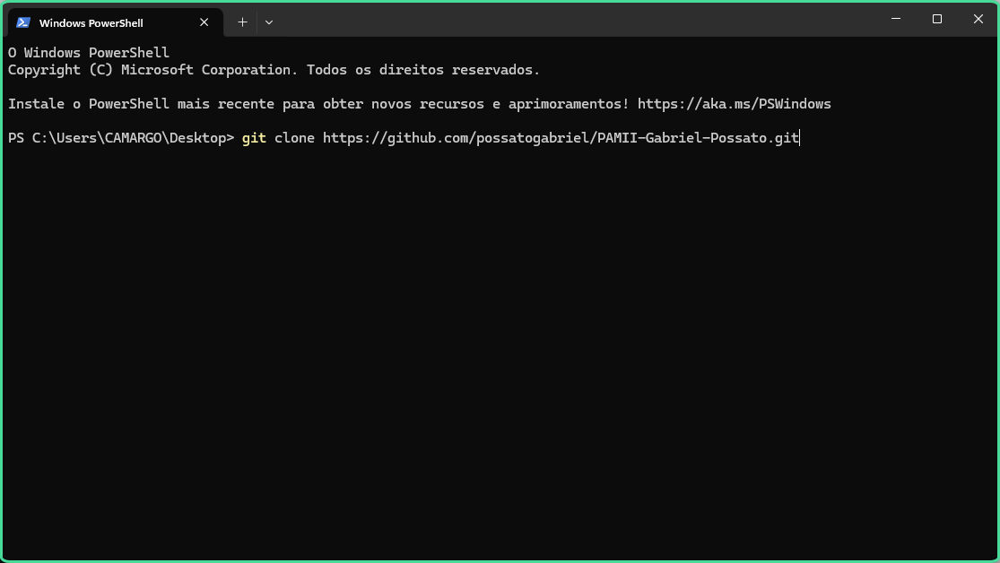
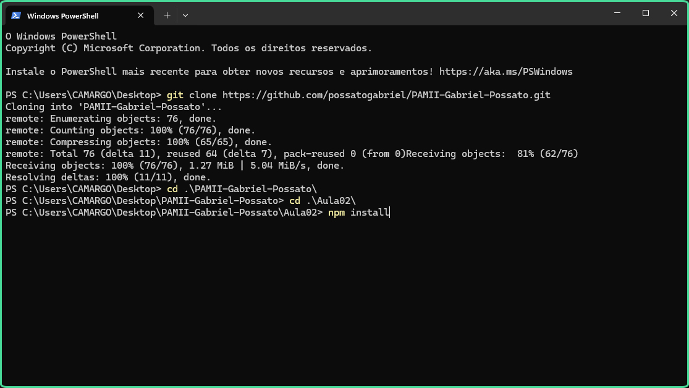
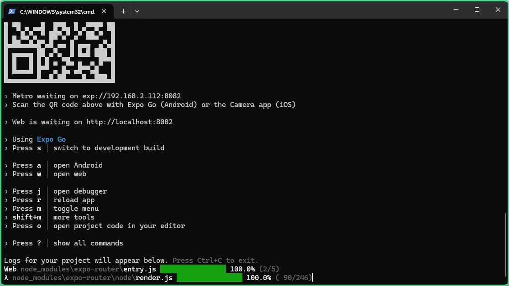

# 📱 Programação Mobile II

## 📰 Descrição

Repositório das aulas de Programação Mobile II com os professores João Siles e Najara Gabriela 

## 💻 Tecnologias Utilizadas
`Trabalhado durante as aulas:`

  

## 🛠️ Como executar o programa 

- Passo 1: Copie o código do repositório e, **com o terminal, clone o repositório em uma pasta de fácil acesso *(ou cole o código abaixo)*** 



```COLE O CÓDIGO: git clone https://github.com/possatogabriel/PAMII-Gabriel-Possato.git```

- Passo 2: Abra a pasta do projeto ***(Aulas)*, e no terminal, instale o "npm" *(cole o código abaixo)***


```COLE O CÓDIGO: npm install```

- Passo 3: Após a instalação, **inicie o projeto *(cole o código abaixo)***


```COLE O CÓDIGO: npm start```

- Passo 4: Abra o projeto no seu navegador de preferência ***(aperte "W" para abrir no navegador padrão do sistema ou cole o link na barra de busca)***


```COLE O CÓDIGO: http://localhost:8081```

## 🙋 Autores
[ <br> <sub> Gabriel Possato </sub>](https://github.com/possatogabriel)
<br>
<br>
<p align = "center">  <br/>  </p>

